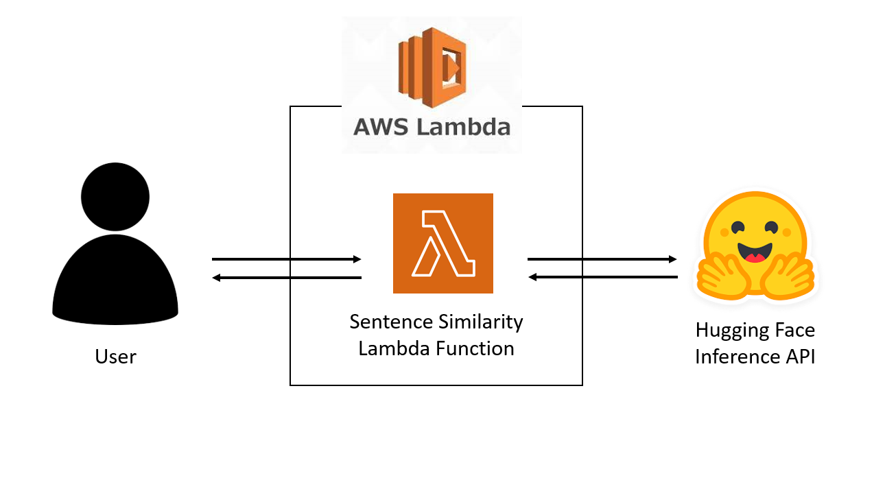
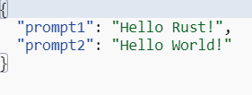
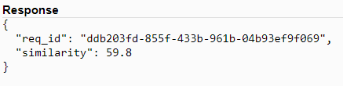

# Rust Sentence Similarity Lambda

## Description

This project demonstrates to how to build a serverless architecture with [AWS Lambda](https://aws.amazon.com/lambda/). The goals of this project were to gain experience working with AWS Lambda for the first time and continue to improve my Rust skills. This serverless application uses the [Hugging Face Inference API](https://huggingface.co/inference-api) to find the cosine similarity between two sentences using the [all-MiniLM-L6-v2 sentence transformer](https://huggingface.co/sentence-transformers/all-MiniLM-L6-v2). The application currently takes two sentences as inputs and returns the cosine similarity between them rounded to two decimal places. If you want to learn more about the basics of cosine similarity, this is a great [resource](https://www.geeksforgeeks.org/cosine-similarity/).

## Architecture

Within the Hugging Face Inference API, the `all-MiniLM-L6-v2` sentence transformer was used to calculate the cosine similarity between the strings.

## Example

### Input

The lambda function takes in a JSON with two sentences to be compared. They are stored under the keys `prompt1` and `prompt2` respectively.

## Output

The output of the application is a JSON containing the similarity score (stored under the `similarity` key) between the sentences. The request ID is also returned, but this is mainly only important for logging and debugging purposes.

## Deploying to Lambda

1. Start by running `make setup` to install all the necessary libraries
2. Next run `make build` to build the binary so it can be deployed as a lambda function
3. Next you can deploy to AWS Lambda in one of a couple ways:
    - Run `make deploy`. You will need to replace the `XXXXXXXXXXXX` with your own AWS account ID and potentially change the name of the lambda function you want to create in the Makefile under the `deploy` section.
    - Use the AWS Lambda console in your browser to upload the resulting zip file as a lambda function. This file will be called `bootstrap.zip` and can be found in the `target/lambda` folder.
4. Run `make invoke` to see if it worked! If so, you should get a json response with a similarity score. You may need to alter the name of the lambda function in the Makefile here as well if you changed it in step 3.

## Docker Container

The docker container can be found [here](https://hub.docker.com/repository/docker/brycewhit13/sentence-similarity-rs/general).

## Future Enhancements

- Enable the user to compare the similarity of multiple sentences to a single base sentence instead of just a one-to-one comparison.
- Add a trigger to the lambda function such as an https API gateway.
